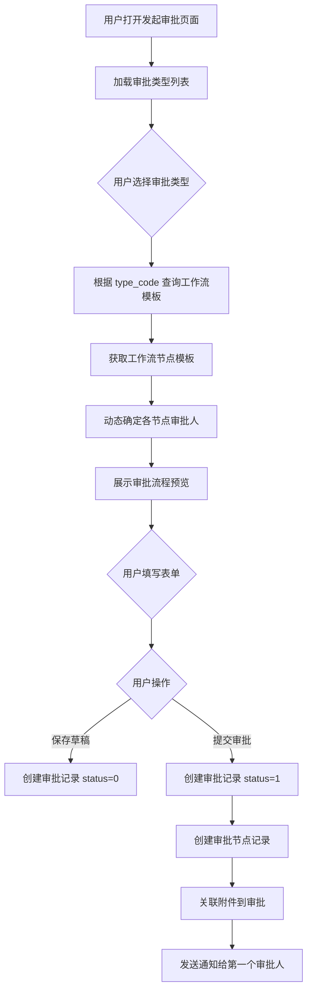
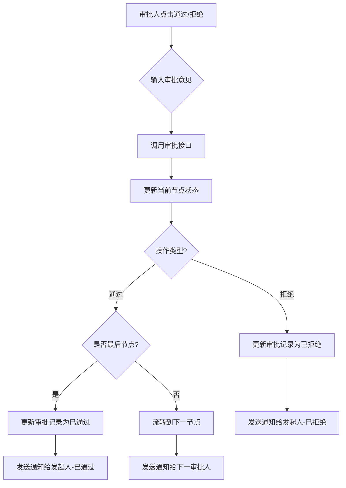

# 审批模块 - 页面与功能设计文档

## 文档概述

本文档详细描述审批系统中 **审批模块** 相关的页面设计、功能实现、数据表使用以及前后端交互规范。本文档基于以下核心文档生成：

| 参考文档 | 说明 |
|----------|------|
| [06_数据库设计文档.md](./06_数据库设计文档.md) | 数据表结构定义 |
| [09_前后端设计需求文档.md](./09_前后端设计需求文档.md) | 前后端设计规范 |
| [05_API接口设计规范.md](./05_API接口设计规范.md) | API 接口定义 |

---

## 一、模块概述

### 1.1 模块组成

审批模块由以下核心子模块组成：

| 子模块 | 说明 | 主要涉及数据表 |
|--------|------|----------------|
| 审批类型管理 | 定义审批业务分类 | `approval_type` |
| 工作流配置 | 审批流程模板配置 | `workflow_template`, `workflow_node_template` |
| 审批发起 | 用户提交审批申请 | `approval_record`, `approval_node`, `attachment` |
| 审批处理 | 审批人处理审批 | `approval_record`, `approval_node`, `notification` |
| 审批查询 | 查看审批列表与详情 | `approval_record`, `approval_node`, `attachment` |

### 1.2 核心数据表关系

```
┌─────────────────┐     ┌───────────────────────┐     ┌─────────────────┐
│   sys_user      │     │   workflow_template   │     │  approval_type  │
│                 │     ├───────────────────────┤     ├─────────────────┤
│ id (PK)         │◄────│ created_by (FK)       │     │ code (UK)       │◄─────┐
└─────────────────┘     │ type_code (FK)        │────►│ id (PK)         │      │
        │               └───────────────────────┘     │ name            │      │
        │                          │                  └─────────────────┘      │
        │                          ▼                                           │
        │               ┌──────────────────────────┐                           │
        │               │ workflow_node_template   │                           │
        │               ├──────────────────────────┤                           │
        │               │ workflow_id (FK)         │                           │
        │               │ approver_type            │                           │
        │               │ approver_id              │ ← 可关联 sys_position      │
        │               └──────────────────────────┘                           │
        │                                                                      │
        ▼                                                                      │
 ┌─────────────────┐     ┌─────────────────┐                                   │
 │ approval_record │────►│  approval_node  │                                   │
 ├─────────────────┤     ├─────────────────┤                                   │
 │ id (PK/UUID)    │     │ approval_id(FK) │                                   │
 │ initiator_id(FK)│     │ approver_id(FK) │                                   │
 │ type_code (FK)  │─────┼─────────────────┼───────────────────────────────────┘
 │ workflow_id(FK) │     │ status          │
 └─────────────────┘     └─────────────────┘
        │
        ▼
 ┌─────────────────┐     ┌─────────────────┐
 │   attachment    │     │  notification   │
 ├─────────────────┤     ├─────────────────┤
 │ approval_id(FK) │     │ user_id (FK)    │
 │ uploader_id(FK) │     │ related_id      │
 └─────────────────┘     └─────────────────┘
```

---

## 二、工作流程概述

### 2.1 配置阶段（管理员操作）

```
审批类型配置 → 工作流模板配置 → 节点审批人配置
     ↓              ↓                ↓
 approval_type  workflow_template  workflow_node_template
```

- 管理员先定义**审批类型**（如请假、报销、采购）
- 为每种类型配置**工作流模板**（定义审批流程）
- 设置**审批节点**（确定每个节点由谁审批）

### 2.2 发起审批（用户操作）

```
选择审批类型 → 填写申请内容 → 上传附件 → 提交
      ↓              ↓            ↓         ↓
  approval_type  approval_record  attachment  approval_node
```

1. 用户选择审批类型（系统自动匹配工作流）
2. 填写标题、内容、紧急程度等
3. 可选上传附件
4. 提交后：
   - 创建 `approval_record`（审批主记录）
   - 根据工作流模板生成 `approval_node`（审批节点实例）
   - 发送 `notification` 通知第一个审批人

### 2.3 审批处理（审批人操作）

```
┌─────────────────────────────────────────────────────────┐
│                                                          │
│  待审批 ──┬─► 通过 ─► 下一节点? ─┬─► 有 → 流转继续审批   │
│           │                      └─► 无 → 审批完成 ✅    │
│           │                                              │
│           └─► 拒绝 ────────────────────► 审批终止 ❌    │
│                                                          │
└─────────────────────────────────────────────────────────┘
```

- **通过**：更新当前节点状态 → 流转到下一节点 → 通知下一审批人
- **拒绝**：更新节点状态 → 审批终止 → 通知发起人
- 所有节点通过 → 审批完成 → 通知发起人

### 2.4 撤回审批（发起人可操作）

```
发起人撤回 → 更新 approval_record.status = 5 → 通知相关审批人
```

- 仅审批进行中可撤回
- 撤回后状态变为 `WITHDRAWN`

### 2.5 数据流向总结

| 阶段 | 操作表 | 查询表 |
|------|--------|--------|
| 发起审批 | `approval_record`, `approval_node`, `attachment` | `approval_type`, `workflow_template`, `workflow_node_template` |
| 审批列表 | - | `approval_record`, `approval_node`, `approval_type`, `sys_user` |
| 审批处理 | `approval_node`, `approval_record`, `notification` | - |
| 撤回 | `approval_record`, `notification` | - |

### 2.6 通知触发点

| 触发点 | 通知对象 |
|--------|----------|
| 提交审批 | 通知第一审批人 |
| 节点通过 | 通知下一审批人 |
| 全部通过 | 通知发起人 |
| 被拒绝 | 通知发起人 |
| 被撤回 | 通知相关审批人 |

---

## 三、审批类型管理

### 3.1 功能说明

审批类型用于定义系统中支持的审批业务分类（如请假、报销、采购等）。

### 3.2 页面设计

**页面路径**: `/admin/approval-types`

**页面文件**: `frontend/src/pages/admin/ApprovalTypeManagementPage.tsx`

#### 3.2.1 界面布局

```
┌─────────────────────────────────────────────────────────────────┐
│  审批类型管理                                    [+ 新增类型]    │
├─────────────────────────────────────────────────────────────────┤
│ 搜索: [关键词输入框]                               [搜索] [重置] │
├─────────────────────────────────────────────────────────────────┤
│ ┌──────┬──────────┬──────────────┬────────┬────────┬──────────┐ │
│ │ 图标 │ 类型编码  │ 类型名称      │  颜色   │  状态  │   操作   │ │
│ ├──────┼──────────┼──────────────┼────────┼────────┼──────────┤ │
│ │ 📅   │ LEAVE    │ 请假申请      │ #3B82F6│  启用  │ 编辑 删除│ │
│ │ 💵   │ EXPENSE  │ 报销申请      │ #10B981│  启用  │ 编辑 删除│ │
│ │ 🛒   │ PURCHASE │ 采购申请      │ #8B5CF6│  启用  │ 编辑 删除│ │
│ └──────┴──────────┴──────────────┴────────┴────────┴──────────┘ │
│                        < 1 2 3 4 5 >                             │
└─────────────────────────────────────────────────────────────────┘
```

#### 3.2.2 表单设计

**新增/编辑审批类型表单**

| 字段 | 组件类型 | 必填 | 数据表字段 | 说明 |
|------|----------|------|------------|------|
| 类型编码 | Input | ✓ | `approval_type.code` | 唯一标识，如 LEAVE、EXPENSE |
| 类型名称 | Input | ✓ | `approval_type.name` | 显示名称 |
| 类型描述 | Textarea | × | `approval_type.description` | 详细说明 |
| 图标 | IconPicker | × | `approval_type.icon` | 图标选择器 |
| 主题颜色 | ColorPicker | × | `approval_type.color` | 颜色选择器 |
| 排序序号 | InputNumber | × | `approval_type.sort_order` | 默认 0 |
| 状态 | Switch | ✓ | `approval_type.status` | 0-禁用 1-启用 |

### 3.3 数据表使用

| 操作 | 数据表 | 字段使用 | SQL 示例 |
|------|--------|----------|----------|
| 列表查询 | `approval_type` | 全部字段 | `SELECT * FROM approval_type ORDER BY sort_order, created_at DESC` |
| 新增类型 | `approval_type` | 除 id、created_at、updated_at 外的字段 | `INSERT INTO approval_type (code, name, ...) VALUES (?, ?, ...)` |
| 编辑类型 | `approval_type` | 可编辑字段 | `UPDATE approval_type SET name=?, ... WHERE id=?` |
| 删除类型 | `approval_type` | id | `DELETE FROM approval_type WHERE id=?` |
| 唯一性校验 | `approval_type` | code | `SELECT COUNT(*) FROM approval_type WHERE code=?` |

### 3.4 API 接口

| 接口 | 方法 | 路径 | 说明 |
|------|------|------|------|
| 获取类型列表 | GET | `/api/v1/approval-types` | 返回全量列表 |
| 获取类型详情 | GET | `/api/v1/approval-types/{id}` | 单个类型详情 |
| 创建审批类型 | POST | `/api/v1/approval-types` | 需管理员权限 |
| 更新审批类型 | PUT | `/api/v1/approval-types/{id}` | 需管理员权限 |
| 删除审批类型 | DELETE | `/api/v1/approval-types/{id}` | 需管理员权限 |

---

## 四、工作流配置

### 4.1 功能说明

工作流模板定义审批流程的节点顺序和审批人规则，是审批流程的核心配置。

### 4.2 页面设计

**页面路径**: `/admin/workflows`

**页面文件**: `frontend/src/pages/admin/WorkflowManagementPage.tsx`

#### 4.2.1 工作流列表界面

```
┌─────────────────────────────────────────────────────────────────┐
│  工作流配置                                    [+ 新增工作流]    │
├─────────────────────────────────────────────────────────────────┤
│ 筛选: [审批类型▼] [状态▼]                          [搜索] [重置] │
├─────────────────────────────────────────────────────────────────┤
│ ┌────────────────┬──────────┬────────┬──────────┬─────────────┐ │
│ │   工作流名称    │ 审批类型  │  状态  │  节点数   │    操作     │ │
│ ├────────────────┼──────────┼────────┼──────────┼─────────────┤ │
│ │ 请假审批流程    │ 请假申请  │  启用  │   2节点   │ 编辑 禁用 删│ │
│ │ 报销审批流程    │ 报销申请  │  启用  │   3节点   │ 编辑 禁用 删│ │
│ │ 大额采购审批    │ 采购申请  │  禁用  │   4节点   │ 编辑 启用 删│ │
│ └────────────────┴──────────┴────────┴──────────┴─────────────┘ │
└─────────────────────────────────────────────────────────────────┘
```

#### 4.2.2 工作流编辑界面

```
┌─────────────────────────────────────────────────────────────────┐
│  编辑工作流                                     [保存] [取消]    │
├─────────────────────────────────────────────────────────────────┤
│ 基本信息                                                         │
│ ┌───────────────────────────────────────────────────────────────┐│
│ │ 模板名称: [请假审批流程        ]                              ││
│ │ 审批类型: [请假申请 ▼]                                        ││
│ │ 模板描述: [员工请假申请的标准审批流程                        ]││
│ │    状态: (●)启用  ( )禁用                                     ││
│ └───────────────────────────────────────────────────────────────┘│
│                                                                  │
│ 审批节点配置                               [+ 添加节点]          │
│ ┌───────────────────────────────────────────────────────────────┐│
│ │ ⋮ 节点1: [直属上级     ] 审批人类型: [部门负责人▼]    [删除]  ││
│ │          审批人: [自动获取部门负责人  ]                        ││
│ │─────────────────────────────────────────────────────────────────│
│ │ ⋮ 节点2: [人事确认     ] 审批人类型: [指定职位▼]      [删除]  ││
│ │          审批人: [人事 ▼]                                      ││
│ │─────────────────────────────────────────────────────────────────│
│ │ ⋮ 节点3: [总经理审批   ] 审批人类型: [指定用户▼]      [删除]  ││
│ │          审批人: [admin ▼]                                     ││
│ └───────────────────────────────────────────────────────────────┘│
│                                                                  │
│ 流程预览                                                         │
│ ┌───────────────────────────────────────────────────────────────┐│
│ │   [发起人] ──► [直属上级] ──► [人事确认] ──► [总经理审批]     ││
│ └───────────────────────────────────────────────────────────────┘│
└─────────────────────────────────────────────────────────────────┘
```

#### 4.2.3 表单设计

**工作流模板表单**

| 字段 | 组件类型 | 必填 | 数据表 | 字段 | 说明 |
|------|----------|------|--------|------|------|
| 模板名称 | Input | ✓ | `workflow_template` | `name` | 工作流模板名称 |
| 审批类型 | Select | ✓ | `workflow_template` | `type_code` | 关联 `approval_type.code` |
| 模板描述 | Textarea | × | `workflow_template` | `description` | 模板说明 |
| 状态 | Radio | ✓ | `workflow_template` | `status` | 0-禁用 1-启用 |

**审批节点配置表单**

| 字段 | 组件类型 | 必填 | 数据表 | 字段 | 说明 |
|------|----------|------|--------|------|------|
| 节点名称 | Input | ✓ | `workflow_node_template` | `node_name` | 如：直属上级、财务审核 |
| 节点顺序 | InputNumber | ✓ | `workflow_node_template` | `node_order` | 审批顺序 (支持拖拽) |
| 审批人类型 | Select | ✓ | `workflow_node_template` | `approver_type` | USER/POSITION/DEPARTMENT_HEAD |
| 审批人/职位 | Select | 条件 | `workflow_node_template` | `approver_id` | 根据类型动态选择 |

### 4.3 审批人类型说明

| 类型值 | 说明 | 审批人确定规则 | 涉及数据表 |
|--------|------|----------------|------------|
| `USER` | 指定用户 | 直接使用 `approver_id` 作为审批人 | `sys_user` |
| `POSITION` | 指定职位 | 查询拥有该职位的用户列表 | `sys_position`, `sys_user_position` |
| `DEPARTMENT_HEAD` | 部门负责人 | 获取发起人所在部门的 `leader_id` | `sys_department`, `sys_user` |

### 4.4 数据表使用

#### 工作流模板操作

| 操作 | 数据表 | 字段使用 | SQL 示例 |
|------|--------|----------|----------|
| 列表查询 | `workflow_template` | 全部字段 + 关联 | `SELECT wt.*, at.name AS type_name FROM workflow_template wt LEFT JOIN approval_type at ON wt.type_code = at.code` |
| 创建模板 | `workflow_template` | name, type_code, description, status, created_by | `INSERT INTO workflow_template (...) VALUES (...)` |
| 更新模板 | `workflow_template` | 可编辑字段 | `UPDATE workflow_template SET ... WHERE id=?` |
| 删除模板 | `workflow_template` | id | `DELETE FROM workflow_template WHERE id=?` |

#### 节点模板操作

| 操作 | 数据表 | 字段使用 | SQL 示例 |
|------|--------|----------|----------|
| 获取节点 | `workflow_node_template` | 全部字段 | `SELECT * FROM workflow_node_template WHERE workflow_id=? ORDER BY node_order` |
| 创建节点 | `workflow_node_template` | 除 id、created_at 外 | `INSERT INTO workflow_node_template (...) VALUES (...)` |
| 批量替换 | `workflow_node_template` | - | 先删除旧节点，再批量插入新节点 |

### 4.5 API 接口

| 接口 | 方法 | 路径 | 说明 |
|------|------|------|------|
| 获取工作流列表 | GET | `/api/v1/workflows` | 分页列表，含节点数统计 |
| 获取工作流详情 | GET | `/api/v1/workflows/{id}` | 含节点配置列表 |
| 根据类型获取 | GET | `/api/v1/workflows?typeCode=LEAVE` | 用于发起审批时自动匹配 |
| 创建工作流 | POST | `/api/v1/workflows` | 同时创建节点 |
| 更新工作流 | PUT | `/api/v1/workflows/{id}` | 同时更新节点 |
| 删除工作流 | DELETE | `/api/v1/workflows/{id}` | 级联删除节点 |
| 启用/禁用 | PUT | `/api/v1/workflows/{id}/status` | 切换状态 |

---

## 五、发起审批

### 5.1 功能说明

用户发起审批申请，系统根据选择的审批类型自动匹配工作流模板，生成审批节点。

### 5.2 页面设计

**页面路径**: `/approval/new`

**页面文件**: `frontend/src/pages/approval/ApprovalCreatePage.tsx`

#### 5.2.1 界面布局

```
┌─────────────────────────────────────────────────────────────────┐
│  发起审批                                                        │
├─────────────────────────────────────────────────────────────────┤
│ ┌───────────────────────────────────────────────────────────────┐│
│ │ 审批类型 *    [请假申请 ▼]                                    ││
│ │──────────────────────────────────────────────────────────────│││
│ │ 审批标题 *    [2026年1月请假申请                             ]││
│ │──────────────────────────────────────────────────────────────│││
│ │ 紧急程度 *    ( )普通  (●)紧急  ( )非常紧急                   ││
│ │──────────────────────────────────────────────────────────────│││
│ │ 截止日期      [2026-01-20         ] 📅                       ││
│ │──────────────────────────────────────────────────────────────│││
│ │ 审批内容      ┌──────────────────────────────────────────────┐││
│ │               │因个人事务需请假3天，时间为1月16日至1月18日，  │││
│ │               │请领导审批。                                   │││
│ │               └──────────────────────────────────────────────┘││
│ │──────────────────────────────────────────────────────────────│││
│ │ 附件上传      [📎 点击或拖拽上传文件]                         ││
│ │               📄 请假单.docx (25KB) [×]                       ││
│ │               📄 医院证明.pdf (128KB) [×]                     ││
│ └───────────────────────────────────────────────────────────────┘│
│                                                                  │
│ 审批流程预览                                                     │
│ ┌───────────────────────────────────────────────────────────────┐│
│ │ ① 直属上级 (李经理) ──► ② 人事确认 (HR) ──► ③ 总经理 (admin) ││
│ └───────────────────────────────────────────────────────────────┘│
│                                                                  │
│                                     [保存草稿]  [提交审批]       │
└─────────────────────────────────────────────────────────────────┘
```

#### 5.2.2 表单字段定义

| 字段 | 组件类型 | 必填 | 数据表 | 字段 | 说明 |
|------|----------|------|--------|------|------|
| 审批类型 | Select | ✓ | `approval_record` | `type_code` | 下拉选择，从 `approval_type` 获取 |
| 审批标题 | Input | ✓ | `approval_record` | `title` | 最长 200 字符 |
| 紧急程度 | RadioGroup | ✓ | `approval_record` | `priority` | 0-普通 1-紧急 2-非常紧急 |
| 截止日期 | DatePicker | × | `approval_record` | `deadline` | 可选 |
| 审批内容 | Textarea/RichText | × | `approval_record` | `content` | 支持 JSON 格式 |
| 附件 | FileUpload | × | `attachment` | 多字段 | 支持多附件上传 |

### 5.3 业务流程



### 5.4 数据表使用详解

#### 5.4.1 发起审批时的数据库操作

| 步骤 | 操作 | 数据表 | 字段/条件 | 说明 |
|------|------|--------|-----------|------|
| 1 | 查询审批类型 | `approval_type` | `status=1` | 获取可用的审批类型列表 |
| 2 | 查询工作流模板 | `workflow_template` | `type_code=? AND status=1` | 根据类型获取启用的工作流 |
| 3 | 查询节点模板 | `workflow_node_template` | `workflow_id=? ORDER BY node_order` | 获取流程节点配置 |
| 4 | 确定部门负责人 | `sys_user`, `sys_department` | `department.leader_id` | 若节点类型为 DEPARTMENT_HEAD |
| 5 | 确定职位审批人 | `sys_user_position`, `sys_user` | `position_id=?` | 若节点类型为 POSITION |
| 6 | 创建审批记录 | `approval_record` | 全部字段 | 主记录，id 为 UUID |
| 7 | 创建审批节点 | `approval_node` | 全部字段 | 根据模板生成实例节点 |
| 8 | 关联附件 | `attachment` | `approval_id=审批ID` | 更新预上传附件的关联 |
| 9 | 发送通知 | `notification` | 新增记录 | 通知第一个审批人 |

#### 5.4.2 创建记录 SQL 示例

**创建审批记录 (approval_record)**
```sql
INSERT INTO approval_record (
    id, title, type_code, content, initiator_id, 
    priority, deadline, status, current_node_order, 
    workflow_id, created_at
) VALUES (
    'uuid-xxx', '2026年1月请假申请', 'LEAVE', '请假3天...', 
    1, 1, '2026-01-20', 1, 1, 
    1, NOW()
);
```

**创建审批节点 (approval_node)**
```sql
INSERT INTO approval_node (
    approval_id, node_name, approver_id, node_order, 
    status, created_at
) VALUES 
    ('uuid-xxx', '直属上级', 2, 1, 0, NOW()),
    ('uuid-xxx', '人事确认', 3, 2, 0, NOW()),
    ('uuid-xxx', '总经理审批', 1, 3, 0, NOW());
```

**创建通知 (notification)**
```sql
INSERT INTO notification (
    id, user_id, title, content, type, 
    related_id, is_read, created_at
) VALUES (
    'notif-uuid', 2, '您有一条新的审批待处理', 
    '张三提交了请假申请，等待您审批', 'APPROVAL',
    'uuid-xxx', 0, NOW()
);
```

### 5.5 API 接口

| 接口 | 方法 | 路径 | 说明 |
|------|------|------|------|
| 获取审批类型列表 | GET | `/api/v1/approval-types` | 用于类型下拉选择 |
| 获取工作流模板 | GET | `/api/v1/workflows?typeCode=xxx` | 用于流程预览 |
| 上传附件 | POST | `/api/v1/files/upload` | 返回附件 ID |
| 提交审批 | POST | `/api/v1/approvals` | 创建审批记录及节点 |

**提交审批请求体**
```json
{
  "title": "2026年1月请假申请",
  "typeCode": "LEAVE",
  "content": "因个人事务需请假3天...",
  "priority": 1,
  "deadline": "2026-01-20",
  "attachmentIds": ["file-uuid-1", "file-uuid-2"]
}
```

---

## 六、审批列表

### 6.1 功能说明

展示用户相关的审批记录，支持多种视角切换：我的待办、我发起的、抄送我的。

### 6.2 页面设计

**页面路径**: `/approval`

**页面文件**: `frontend/src/pages/approval/ApprovalListPage.tsx`

#### 6.2.1 界面布局

```
┌─────────────────────────────────────────────────────────────────┐
│  审批列表                                                        │
├─────────────────────────────────────────────────────────────────┤
│ [我的待办(5)] [我发起的(12)] [抄送我的(3)]                       │
├─────────────────────────────────────────────────────────────────┤
│ 筛选: [审批类型▼] [状态▼] [时间范围] [关键词    ] [搜索] [重置] │
├─────────────────────────────────────────────────────────────────┤
│ ┌──────────────────┬────────┬────────┬─────────┬────────┬─────┐ │
│ │     审批标题      │  类型  │  状态  │  发起人  │ 发起时间│ 操作│ │
│ ├──────────────────┼────────┼────────┼─────────┼────────┼─────┤ │
│ │ 🔴 2月报销申请     │ 报销   │ 待审批 │  王强    │ 01-15  │ 审批│ │
│ │ 🟡 服务器采购申请  │ 采购   │ 审批中 │  张三    │ 01-14  │ 查看│ │
│ │ 🟢 1月请假申请     │ 请假   │ 已通过 │  我      │ 01-10  │ 查看│ │
│ │ 🔵 出差备案        │ 出差   │ 已撤回 │  我      │ 01-08  │ 查看│ │
│ └──────────────────┴────────┴────────┴─────────┴────────┴─────┘ │
│                        < 1 2 3 ... 10 >                          │
└─────────────────────────────────────────────────────────────────┘
```

### 6.3 Tab 页签数据来源

| Tab 页签 | 筛选条件 | 数据表查询 | 说明 |
|----------|----------|------------|------|
| 我的待办 | 当前用户是当前节点审批人 | `approval_record` + `approval_node` | 需要我处理的审批 |
| 我发起的 | `initiator_id = 当前用户ID` | `approval_record` | 我提交的审批 |
| 抄送我的 | 预留扩展 | - | 后续可扩展抄送功能 |

### 6.4 列表字段与数据来源

| 字段 | 数据表 | 字段/关联 | 说明 |
|------|--------|-----------|------|
| 审批标题 | `approval_record` | `title` | 点击进入详情页 |
| 审批类型 | `approval_record` → `approval_type` | `type_code` → `name` | 关联查询类型名称 |
| 状态 | `approval_record` | `status` | 使用不同颜色标签展示 |
| 紧急程度 | `approval_record` | `priority` | 🔴紧急 🟡普通 |
| 发起人 | `approval_record` → `sys_user` | `initiator_id` → `nickname` | 关联查询用户昵称 |
| 当前审批人 | `approval_node` → `sys_user` | 当前节点的 `approver_id` | 仅待办/审批中显示 |
| 发起时间 | `approval_record` | `created_at` | 格式化日期 |

### 6.5 筛选条件

| 筛选项 | 字段 | 类型 | 数据来源 |
|--------|------|------|----------|
| 审批类型 | `type_code` | 下拉选择 | `approval_type` 表 |
| 状态 | `status` | 下拉选择 | 状态枚举 (0-5) |
| 时间范围 | `created_at` | 日期范围 | - |
| 关键词 | `title` | 模糊搜索 | LIKE 查询 |

### 6.6 数据表查询 SQL 示例

**我的待办**
```sql
SELECT 
    ar.id, ar.title, ar.type_code, ar.status, ar.priority,
    ar.created_at, 
    u.nickname AS initiator_name,
    at.name AS type_name,
    an.approver_id AS current_approver_id
FROM approval_record ar
INNER JOIN approval_node an ON ar.id = an.approval_id 
    AND ar.current_node_order = an.node_order
INNER JOIN sys_user u ON ar.initiator_id = u.id
LEFT JOIN approval_type at ON ar.type_code = at.code
WHERE an.approver_id = #{currentUserId} 
    AND an.status = 0  -- 待审批
    AND ar.status IN (1, 2)  -- PENDING 或 IN_PROGRESS
ORDER BY ar.priority DESC, ar.created_at DESC
LIMIT #{offset}, #{pageSize};
```

**我发起的**
```sql
SELECT 
    ar.id, ar.title, ar.type_code, ar.status, ar.priority,
    ar.created_at, 
    u.nickname AS initiator_name,
    at.name AS type_name
FROM approval_record ar
INNER JOIN sys_user u ON ar.initiator_id = u.id
LEFT JOIN approval_type at ON ar.type_code = at.code
WHERE ar.initiator_id = #{currentUserId}
ORDER BY ar.created_at DESC
LIMIT #{offset}, #{pageSize};
```

### 6.7 API 接口

| 接口 | 方法 | 路径 | 说明 |
|------|------|------|------|
| 审批列表 | GET | `/api/v1/approvals?page=&pageSize=&status=&type=` | 通用列表查询 |
| 我的待办 | GET | `/api/v1/approvals/todo?page=&pageSize=` | 待我审批的列表 |
| 我发起的 | GET | `/api/v1/approvals/initiated?page=&pageSize=` | 我提交的列表 |

---

## 七、审批详情

### 7.1 功能说明

展示审批申请的完整信息，包括基本信息、审批内容、流程进度、附件列表，并提供审批操作入口。

### 7.2 页面设计

**页面路径**: `/approval/:id`

**页面文件**: `frontend/src/pages/approval/ApprovalDetailPage.tsx`

#### 7.2.1 界面布局

```
┌─────────────────────────────────────────────────────────────────┐
│  < 返回                                                          │
├─────────────────────────────────────────────────────────────────┤
│                                                                  │
│  2026年1月请假申请                        [待审批] [紧急🔴]       │
│  ─────────────────────────────────────────────────────────────── │
│                                                                  │
│  ┌─ 基本信息 ────────────────────────────────────────────────┐  │
│  │  审批类型：请假申请          发起人：张三                  │  │
│  │  发起时间：2026-01-15 09:30  截止日期：2026-01-20         │  │
│  └────────────────────────────────────────────────────────────┘  │
│                                                                  │
│  ┌─ 审批内容 ────────────────────────────────────────────────┐  │
│  │  因个人事务需请假3天，时间为1月16日至1月18日。            │  │
│  │  请领导审批。                                              │  │
│  └────────────────────────────────────────────────────────────┘  │
│                                                                  │
│  ┌─ 审批流程 ────────────────────────────────────────────────┐  │
│  │                                                            │  │
│  │   ✓ 节点1: 直属上级                                       │  │
│  │      审批人: 李经理                                        │  │
│  │      状态: ✅ 已通过                                       │  │
│  │      意见: 同意请假                                        │  │
│  │      时间: 2026-01-15 10:30                               │  │
│  │   ────────────────────────────────────────────────────    │  │
│  │   ○ 节点2: 人事确认  [当前节点]                           │  │
│  │      审批人: HR 小王                                       │  │
│  │      状态: ⏳ 待审批                                       │  │
│  │   ────────────────────────────────────────────────────    │  │
│  │   ○ 节点3: 总经理审批                                     │  │
│  │      审批人: admin                                         │  │
│  │      状态: 🔘 未开始                                       │  │
│  │                                                            │  │
│  └────────────────────────────────────────────────────────────┘  │
│                                                                  │
│  ┌─ 附件列表 ────────────────────────────────────────────────┐  │
│  │  📄 请假单.docx (25KB)       [预览] [下载]                 │  │
│  │  📄 医院证明.pdf (128KB)     [预览] [下载]                 │  │
│  └────────────────────────────────────────────────────────────┘  │
│                                                                  │
│  ┌─ 审批操作 ────────────────────────────────────────────────┐  │
│  │  审批意见: [请输入审批意见...                             ]│  │
│  │                                     [拒绝]  [通过]         │  │
│  └────────────────────────────────────────────────────────────┘  │
│                                                                  │
└─────────────────────────────────────────────────────────────────┘
```

### 7.3 数据展示区域与来源

| 区域 | 数据内容 | 数据表/字段 |
|------|----------|-------------|
| 基本信息 | 标题、类型、状态、紧急程度、发起人、时间 | `approval_record` 主表字段 |
| 审批内容 | 详细描述文本/JSON | `approval_record.content` |
| 审批流程 | 节点列表及状态 | `approval_node` 关联查询 |
| 附件列表 | 文件名、大小、预览/下载 | `attachment` 表 |

### 7.4 数据表查询 SQL 示例

**获取审批详情**
```sql
-- 主记录
SELECT 
    ar.*,
    at.name AS type_name,
    at.icon AS type_icon,
    at.color AS type_color,
    u.nickname AS initiator_name,
    u.avatar AS initiator_avatar
FROM approval_record ar
LEFT JOIN approval_type at ON ar.type_code = at.code
LEFT JOIN sys_user u ON ar.initiator_id = u.id
WHERE ar.id = #{approvalId};

-- 审批节点
SELECT 
    an.*,
    u.nickname AS approver_name,
    u.avatar AS approver_avatar
FROM approval_node an
LEFT JOIN sys_user u ON an.approver_id = u.id
WHERE an.approval_id = #{approvalId}
ORDER BY an.node_order;

-- 附件列表
SELECT *
FROM attachment
WHERE approval_id = #{approvalId};
```

### 7.5 操作按钮显示规则

| 按钮 | 显示条件 | 说明 |
|------|----------|------|
| 通过/拒绝 | 当前用户是当前节点审批人 且 节点状态为待审批 | 审批操作 |
| 撤回 | 当前用户是发起人 且 状态为 PENDING/IN_PROGRESS | 发起人撤回 |
| 催办 | 当前用户是发起人 且 状态为 PENDING/IN_PROGRESS | 预留功能 |

### 7.6 API 接口

| 接口 | 方法 | 路径 | 说明 |
|------|------|------|------|
| 获取审批详情 | GET | `/api/v1/approvals/{id}` | 含节点和附件信息 |
| 审批操作 | POST | `/api/v1/approvals/{id}/approve` | 通过或拒绝 |
| 撤回审批 | POST | `/api/v1/approvals/{id}/withdraw` | 发起人操作 |
| 下载附件 | GET | `/api/v1/files/download/{id}` | 下载文件 |

---

## 八、审批处理

### 8.1 功能说明

审批人对待办审批进行处理，包括通过、拒绝操作。

### 8.2 业务流程



### 8.3 数据表操作详解

#### 8.3.1 审批通过

| 步骤 | 操作 | 数据表 | SQL 示例 |
|------|------|--------|----------|
| 1 | 更新当前节点 | `approval_node` | `UPDATE approval_node SET status=1, comment=?, approved_at=NOW() WHERE approval_id=? AND node_order=?` |
| 2 | 检查下一节点 | `approval_node` | `SELECT * FROM approval_node WHERE approval_id=? AND node_order=当前+1` |
| 3a | 最后节点-完成 | `approval_record` | `UPDATE approval_record SET status=3, completed_at=NOW() WHERE id=?` |
| 3b | 非最后-流转 | `approval_record` | `UPDATE approval_record SET status=2, current_node_order=current_node_order+1 WHERE id=?` |
| 4 | 发送通知 | `notification` | 通知下一审批人或发起人 |

#### 8.3.2 审批拒绝

| 步骤 | 操作 | 数据表 | SQL 示例 |
|------|------|--------|----------|
| 1 | 更新当前节点 | `approval_node` | `UPDATE approval_node SET status=2, comment=?, approved_at=NOW() WHERE approval_id=? AND node_order=?` |
| 2 | 更新审批记录 | `approval_record` | `UPDATE approval_record SET status=4, completed_at=NOW() WHERE id=?` |
| 3 | 发送通知 | `notification` | 通知发起人审批被拒绝 |

### 8.4 API 接口

**审批操作接口**
```
POST /api/v1/approvals/{id}/approve
Authorization: Bearer {token}
Content-Type: application/json

{
  "approved": true,        // true-通过 false-拒绝
  "comment": "同意请假申请" // 审批意见
}
```

**响应**
```json
{
  "code": 200,
  "message": "审批成功",
  "data": null
}
```

---

## 九、撤回审批

### 9.1 功能说明

发起人可以撤回自己提交的审批申请（状态未终结时）。

### 9.2 业务规则

| 规则项 | 说明 |
|--------|------|
| 操作人 | 仅发起人可撤回 |
| 状态限制 | 仅 PENDING、IN_PROGRESS 状态可撤回 |
| 撤回后状态 | 变更为 WITHDRAWN (5) |

### 9.3 数据表操作

```sql
-- 校验权限
SELECT initiator_id, status FROM approval_record WHERE id = ?;

-- 撤回操作
UPDATE approval_record 
SET status = 5, updated_at = NOW() 
WHERE id = ? AND initiator_id = ? AND status IN (1, 2);

-- 发送通知给相关审批人
INSERT INTO notification (id, user_id, title, content, type, related_id, is_read, created_at)
SELECT 
    UUID(), approver_id, '审批已被撤回', 
    CONCAT('发起人已撤回审批申请：', (SELECT title FROM approval_record WHERE id = ?)),
    'APPROVAL', ?, 0, NOW()
FROM approval_node 
WHERE approval_id = ? AND status = 0;
```

### 9.4 API 接口

```
POST /api/v1/approvals/{id}/withdraw
Authorization: Bearer {token}
```

---

## 十、通知触发机制

### 10.1 通知场景汇总

| 触发场景 | 接收人 | 通知类型 | 通知标题 | 通知内容模板 |
|----------|--------|----------|----------|--------------|
| 提交审批 | 第一个审批人 | APPROVAL | 您有一条新的审批待处理 | {发起人} 提交了 {审批类型}，等待您审批 |
| 节点通过 | 下一个审批人 | APPROVAL | 您有一条新的审批待处理 | {审批标题} 已流转到您，请及时处理 |
| 节点拒绝 | 发起人 | APPROVAL | 您的审批已被拒绝 | {审批标题} 被 {审批人} 拒绝，原因：{意见} |
| 审批通过 | 发起人 | APPROVAL | 您的审批已全部通过 | {审批标题} 已通过所有审批节点 |
| 审批撤回 | 相关审批人 | APPROVAL | 审批已被发起人撤回 | {发起人} 撤回了审批：{审批标题} |

### 10.2 数据表操作

```sql
INSERT INTO notification (
    id, user_id, title, content, type, related_id, is_read, created_at
) VALUES (
    UUID(), #{receiverId}, #{title}, #{content}, 'APPROVAL', #{approvalId}, 0, NOW()
);
```

---

## 十一、状态枚举定义

### 11.1 审批记录状态 (approval_record.status)

| 值 | 常量名 | 中文名称 | 说明 | 允许的操作 |
|----|--------|----------|------|------------|
| 0 | DRAFT | 草稿 | 未提交的草稿 | 编辑、删除、提交 |
| 1 | PENDING | 待审批 | 等待第一个节点审批 | 撤回 |
| 2 | IN_PROGRESS | 审批中 | 多节点流程进行中 | 撤回 |
| 3 | APPROVED | 已通过 | 所有节点通过 | 无 |
| 4 | REJECTED | 已拒绝 | 任一节点拒绝 | 无 |
| 5 | WITHDRAWN | 已撤回 | 发起人撤回 | 无 |

### 11.2 审批节点状态 (approval_node.status)

| 值 | 常量名 | 中文名称 | 说明 |
|----|--------|----------|------|
| 0 | PENDING | 待审批 | 等待该节点处理 |
| 1 | APPROVED | 已通过 | 该节点已通过 |
| 2 | REJECTED | 已拒绝 | 该节点已拒绝 |

### 11.3 审批人类型 (workflow_node_template.approver_type)

| 值 | 说明 | 确定审批人逻辑 |
|----|------|----------------|
| USER | 指定用户 | 直接使用 `approver_id` |
| POSITION | 指定职位 | 查询 `sys_user_position` 获取用户列表 |
| DEPARTMENT_HEAD | 部门负责人 | 查询发起人部门的 `leader_id` |

### 11.4 紧急程度 (approval_record.priority)

| 值 | 说明 | 显示样式 |
|----|------|----------|
| 0 | 普通 | 默认样式 |
| 1 | 紧急 | 黄色标签 |
| 2 | 非常紧急 | 红色标签 |

---

## 十二、前端组件设计

### 12.1 业务组件列表

| 组件名称 | 文件路径 | 功能说明 |
|----------|----------|----------|
| ApprovalTypeSelect | `components/business/ApprovalTypeSelect.tsx` | 审批类型下拉选择 |
| ApprovalStatusBadge | `components/business/ApprovalStatusBadge.tsx` | 审批状态标签 |
| PriorityBadge | `components/business/PriorityBadge.tsx` | 紧急程度标签 |
| ApprovalTimeline | `components/business/ApprovalTimeline.tsx` | 审批流程时间线 |
| WorkflowNodeEditor | `components/business/WorkflowNodeEditor.tsx` | 工作流节点编辑器 |
| FileUploader | `components/business/FileUploader.tsx` | 文件上传组件 |
| AttachmentList | `components/business/AttachmentList.tsx` | 附件列表展示 |

### 12.2 TypeScript 类型定义

```typescript
// types/approval.ts

/** 审批类型 */
interface ApprovalType {
  id: number;
  code: string;
  name: string;
  description?: string;
  icon?: string;
  color?: string;
  sortOrder: number;
  status: number;
}

/** 审批记录 */
interface ApprovalRecord {
  id: string; // UUID
  title: string;
  typeCode: string;
  typeName: string;
  content?: string;
  initiatorId: number;
  initiatorName: string;
  priority: 0 | 1 | 2;
  deadline?: string;
  status: ApprovalStatus;
  statusName: string;
  currentNodeOrder: number;
  workflowId?: number;
  nodes?: ApprovalNode[];
  attachments?: Attachment[];
  createdAt: string;
  updatedAt?: string;
  completedAt?: string;
}

/** 审批节点 */
interface ApprovalNode {
  id: number;
  approvalId: string;
  nodeName: string;
  approverId: number;
  approverName: string;
  approverAvatar?: string;
  nodeOrder: number;
  status: NodeStatus;
  comment?: string;
  approvedAt?: string;
}

/** 附件 */
interface Attachment {
  id: string;
  originalName: string;
  fileSize: number;
  fileType?: string;
  filePath: string;
  previewSupport: boolean;
}

/** 审批状态枚举 */
enum ApprovalStatus {
  DRAFT = 0,
  PENDING = 1,
  IN_PROGRESS = 2,
  APPROVED = 3,
  REJECTED = 4,
  WITHDRAWN = 5
}

/** 节点状态枚举 */
enum NodeStatus {
  PENDING = 0,
  APPROVED = 1,
  REJECTED = 2
}
```

---

## 十三、后端服务设计

### 13.1 服务接口定义

```java
/**
 * 审批服务接口
 */
public interface ApprovalService {
    
    /**
     * 创建审批申请
     * 操作表：approval_record, approval_node, attachment, notification
     */
    String createApproval(Long userId, ApprovalCreateRequest request);
    
    /**
     * 获取审批详情
     * 查询表：approval_record, approval_node, attachment, approval_type, sys_user
     */
    ApprovalDetailVO getApprovalDetail(String id);
    
    /**
     * 分页查询审批列表
     * 查询表：approval_record, approval_type, sys_user
     */
    PageResult<ApprovalListVO> getApprovalList(ApprovalQueryRequest request);
    
    /**
     * 获取我的待办
     * 查询表：approval_record, approval_node, approval_type, sys_user
     */
    PageResult<ApprovalListVO> getTodoList(Long userId, PageRequest request);
    
    /**
     * 获取我发起的
     * 查询表：approval_record, approval_type
     */
    PageResult<ApprovalListVO> getInitiatedList(Long userId, PageRequest request);
    
    /**
     * 审批操作（通过/拒绝）
     * 操作表：approval_node, approval_record, notification
     */
    void approve(String id, Long userId, ApproveActionRequest request);
    
    /**
     * 撤回审批
     * 操作表：approval_record, notification
     */
    void withdraw(String id, Long userId);
}
```

### 13.2 Mapper 定义

```java
/**
 * 审批记录 Mapper
 */
@Mapper
public interface ApprovalRecordMapper extends BaseMapper<ApprovalRecord> {
    
    /**
     * 查询待办列表
     * 关联表：approval_node, sys_user, approval_type
     */
    List<ApprovalListVO> selectTodoList(@Param("userId") Long userId, 
                                         @Param("offset") int offset, 
                                         @Param("limit") int limit);
    
    /**
     * 查询我发起的列表
     * 关联表：sys_user, approval_type
     */
    List<ApprovalListVO> selectInitiatedList(@Param("userId") Long userId,
                                              @Param("offset") int offset,
                                              @Param("limit") int limit);
    
    /**
     * 获取审批详情（含关联信息）
     */
    ApprovalDetailVO selectDetailById(@Param("id") String id);
}

/**
 * 审批节点 Mapper
 */
@Mapper
public interface ApprovalNodeMapper extends BaseMapper<ApprovalNode> {
    
    /**
     * 获取当前待审批节点
     */
    ApprovalNode selectCurrentNode(@Param("approvalId") String approvalId);
    
    /**
     * 获取审批的所有节点
     */
    List<ApprovalNode> selectByApprovalId(@Param("approvalId") String approvalId);
}
```

---

## 版本记录

| 版本 | 日期 | 作者 | 说明 |
|------|------|------|------|
| 1.0.0 | 2026-01-15 | - | 初始版本 |
